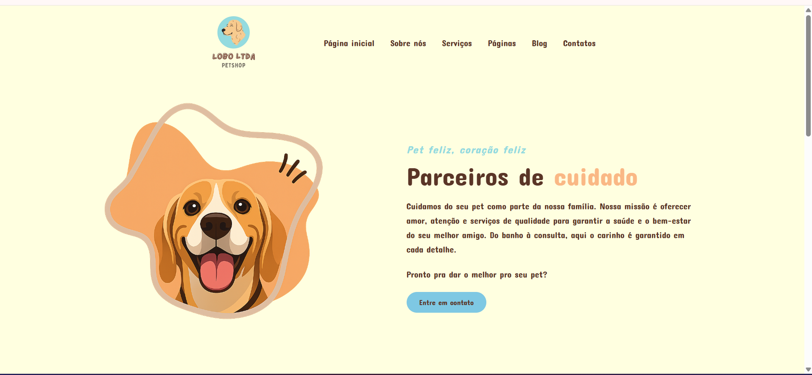
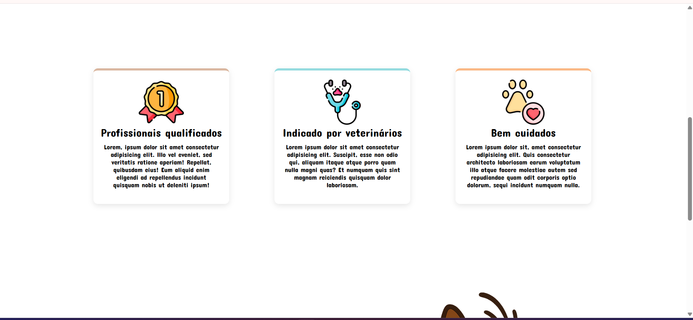
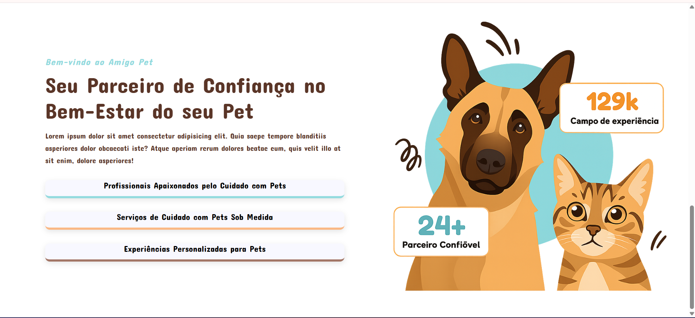

# 🐾 Petshop - Lobo LTDA

Bem-vindo ao **Petshop Lobo LTDA**
Um site moderno e responsivo para petshops que desejam apresentar seus serviços, conquistar clientes e facilitar o contato com tutores de pets.  


## 📸 Prévia do Projeto

### Página inicial


### Serviços em destaque


### Seção sobre confiança e experiência



## ✨ Funcionalidades
- Página inicial com destaque para serviços e diferenciais  
- Seção **Sobre nós** apresentando a empresa  
- Área de **Serviços** listando o que o petshop oferece  
- Sessão de **Contato** com botão direto para falar com os responsáveis  
- Layout totalmente **responsivo** (funciona em celular, tablet e desktop)  


## 🛠️ Tecnologias utilizadas
- **HTML5**  
- **CSS3**  


## 🚀 Como executar o projeto localmente
1. Clone este repositório:
   ```bash
   git clone https://github.com/fernandlvs/Petshop.git

